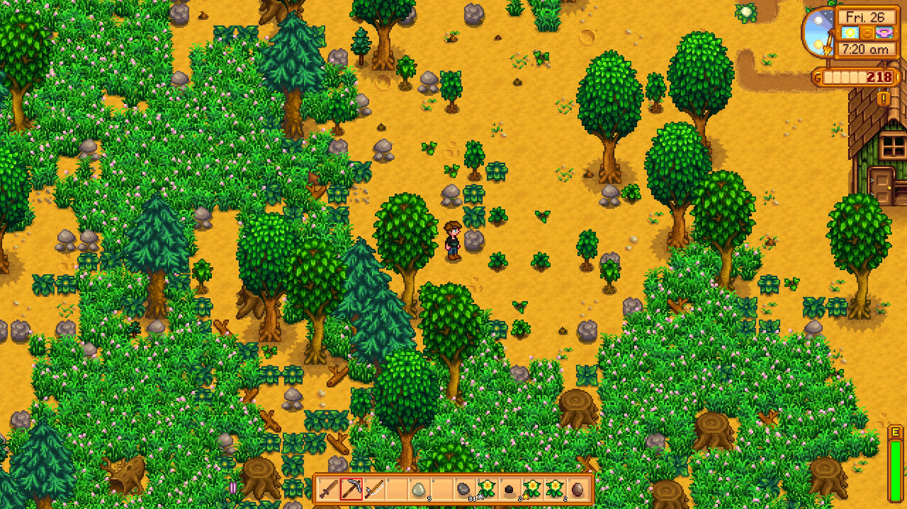

# stardew-tree-sim
This repository is a project that explores a simulation and mathematical analysis of a simplified model of tree dynamics, based on how trees grow and spread in the video game [Stardew Valley](https://www.stardewvalley.net/). 

## Overview of a Stardew Valley Forest




THe screenshot above shows an example of the vegetation on a farm in Stardew Valley. There are several types of trees, grass, and other vegetation. The trees and grass naturally spread to fill available space. Thinking like a biologist, we might wonder: How quickly do the trees fill area? Can the tree populations go extinct? Given several types of trees, will one of the tree species eventually go extinct? While certainly not needed to play the game, answers to these questions give insight into more serious questions in mathematical biology. These questions are the kind we might use a model of real world tree populations to study. In either case, we have to figure out how to calculate the emergent properties of these dynamics. 

First, let's note that the dynamics occur on a grid. You can see a red square that indicates one cell of this grid.


If we draw the grid, we see that each individual tree, tuff of grass, bush, and so on occupy a single cell in a grid. 


If we focus on the trees, we see that there are five stages of living trees. The first four are a **planted seed** (stage 1), a germinate **seedling** (stage 2), a **bush** form (stage 3), and a **sapling** (stage 4).   


The fifth stage is a mature tree (stage 5). Trees can die and leave stumps not shown. 


Because there is a discrete set of stages on a discrete,  we can represent the tree population dynamics using cellular automata.


## Stardew Valley Tree Dynamics as a Cellular Automaton

Basically, a [Cellular Automaton](https://en.wikipedia.org/wiki/Cellular_automaton) is a grid of cells (or lattice represented by integer points $\mathbb{Z}^n$). Each cell contains a value, representing the state of that cell. In a cellular automaton, the states are also discrete and can be represented as integers. Let's call a grid with a specific choice of state for each cell, a configuration of the grid (sometimes this is also called a state). The states change over time but time is discrete as well. How the grid changes is determined by applying a *transition rule* or *update rule* to its current configuration. This transition rule plays the same role as an equation of motion or other. Stardew valley trees are a good example of how cellular automata can represent real-world phenomena, even when those phenomena aren't really discrete. The trees occupy positions on a lattice and the lattice has a state for each tree growth stage and a state for empty ground. Note we can simply add more states to represent other tree species or grass, etc.  Here's an example


While in principle one could define a transition rule that is any function maps configurations to other configurations, in practice it is more interesting to use transition rules which are defined **locally**. That means, for a given cell, its change in state during one transition depends only on its current state and the state of nearby cells. For example, in the grid below, the next state of the blue cell depends on its current state and the current state of the surrounding gray cells. 


If we define a local transition rule for each **neighborhood**, we can apply this rule for every cell and its neighborhood to define a transition rule for an entire grid. Note we sometimes have to make special choices for the boundary of the grid, similar to boundary conditions for differential equations. We can vary the neighborhood for rules that have a longer distance spatial interaction. 


In many physical systems, we wish represent to how some quantity varies in space and time in a region of space. Think for instance how an electric and magnetic field. Or the distribution of temperature and pressure. Or in this case, the distribution of trees by various growth stages. There are several common ways to represent such systems mathematically. A quick way to classify them is by asking if states, time, space are discrete or continuous. Continuous states, time, or space means we can use $n$_tuples of real numbers $\mathbb{R}^n$ instead of integers $\mathbb{Z}^n$. Cellular automata are what you get when all three are discrete. You can see some other examples.


|      |            | Space                       |                                 |                                           |                                |
| ---- | ---------- | --------------------------- | ------------------------------- | ----------------------------------------- | ------------------------------ |
|      |            | Discrete                    |                                 | Continuous                                |                                |
|      |            | Discrete States             | Continuous States               | Discrete States                           | Cont. States                   |
| Time | Discrete   | Cellular Automata           | Iterated Maps/Functions         | Integral Equations                        | Integral Equations             | 
|      | Continuous | Markov Processes (via prob) | Ordinary Differential Equations | Partial Differential Equations (via prob) | Partial Differential Equations |


Although these mathematical representations of the same physical systems are very different, they often serve as good approximations for one another. Sometimes by converting from one form to another, we get new insight. However, this has to be done with care, because not all cellular automata can be represented as a partial differential equation, so there might not be any conversion. But usually interesting physical systems have symmetries or other properties that make this conversion possible. For instance, cellular automata usually have translational symmetries and rotational symmetries with their grid. At large scales, these symmetries approximate the continuous symmetries of continuous space. The local transition rules of cellular automata correspond to the local rules of partial differential equations. We can also use different grids, so hexagonal grids or triangular grids are also possible for cellular automata, but more complicated to program. It turns out that the emergent properties of interesting physical systems often do not depend strongly such choices.


## How do trees grow? 

To start thinking about transition rules, trees have two major processes here. They grow and they reproduce. In Stardew Valley, these processes occur over night while the player sleeps. Thus our transition rule is discrete time. Of these processes, growth is simpler. Note there are five growth stages. According to the [Stardew Valley wiki on trees](https://stardewvalleywiki.com/Trees#Growth_Cycle), the oak, maple, and pine trees have a 20% chance to grow per night increase in growth state, except for the transition from growth state $s=4$ to growth stage $s=5$. The transition from $4\to 5$ cannot occur for a given cell, if there is a stage 5 tree in the Moore neighborhood (the 8 currounding cells) of the cell. 

The wiki says this last transition takes "twice as a long" (which should mean a 10%), however, investigating the [decompiled game code](https://github.com/veywrn/StardewValley/tree/master), the method which updates tree, the method [Tree:dayUpdate](https://github.com/veywrn/StardewValley/blob/master/StardewValley/TerrainFeatures/Tree.cs) appears to show a 20% for the last stage. We won't worry too much about that, because ultimately we want to calculate how much the overall behavior depends on such choices. Note that we will only consider the case of unfertilized trees in Stardew Valley. Because growth is random, we have a stochastic cellular automaton, with a stochastic transition rule. This makes the growth of an individual tree into a [Markov chain](https://en.wikipedia.org/wiki/Markov_chain). We can represent this diagrammatically as:


This also makes the entire grid into a Markov chain. There exists a matrix which specifics the transition probability from any possible configuration of the grid to any other possible configuration. But the number of configurations is so large, even for small grids and this matrix is stupendous in size. For one tree species, 48 by 64 grid has on $6 ^ {48 \times 64} $ possible configurations which is on the order of $10^{2390}$. For a quick size comparison, the [age of the universe](https://en.wikipedia.org/wiki/Hubble%27s_law#Hubble_time) is estimated at only $ 4.55 \times 10 ^{17]$ *seconds* and the number of orderings of a deck of 52 playing cards is only $52! \approx 10^{68}$.   Note however that for most pairs of grids, the transition probability is zero. 

For the most part, this transition rule is independent with no spatial interactions at except for the last stage. If we ignore this part, we get a transition matrix that looks like this:


Here each entry of the matrix gives a transition probability  $A_{ij} = \Pr ( j \to i) $. If we know the initial state, we can just look at the corresponding column to get the transition probabilities. Note that the diagonals are the probability that no change occurs. Note also that the final stage is an *absorbing state*. Once a tree is mature, it stays there in this Markov chain (other processes will change that later). Using matrix powers $A^n $, we can calculate the probability of transition from a given state $j$ to any other state $i$ after $n$ transitions (or $n$ nights in game). This means that the entry $(A^n)_{51}$ is the cumulative density function $F(n) $ for the growing time, the number of days (or nights) until fully grown. The CDF $F(n)$ is the probability that after $n$ days, a tree has fully grown (neglecting any spatial effects). The probability that the growing time is exactly $k$ days is $f(k) = F(k) - F(k-1)$ and from this probability mass function $f$, it is possible to calculate the mean growing time. We can use the CDF to calculate the median growing time.


All in all, it takes around a month for a tree to grow from a planted seed to full maturity. Note the tree fertilizer shortens this to 4 days exactly. 


## How do trees reproduce? 

```cs
// check if stage s >= 5  and roll for reproduction with 15% chance
if ((int)growthStage >= 5 && environment is Farm && Game1.random.NextDouble() < 0.15)
			{   
                // randomly select coordinates in 7 x 7 box centered at tree location
				int xCoord = Game1.random.Next(-3, 4) + (int)tileLocation.X;
				int yCoord = Game1.random.Next(-3, 4) + (int)tileLocation.Y;
				Vector2 location = new Vector2(xCoord, yCoord);
                
                // check if selected coordinates are a valid loction 
				string noSpawn = environment.doesTileHaveProperty(xCoord, yCoord, "NoSpawn", "Back");
				if ((noSpawn == null || (!noSpawn.Equals("Tree") && !noSpawn.Equals("All") && !noSpawn.Equals("True"))) && environment.isTileLocationOpen(new Location(xCoord, yCoord)) && !environment.isTileOccupied(location) && environment.doesTileHaveProperty(xCoord, yCoord, "Water", "Back") == null && environment.isTileOnMap(location))
				{
                    // add tree at new location
					environment.terrainFeatures.Add(location, new Tree(treeType, 0));
				}
			}
```
