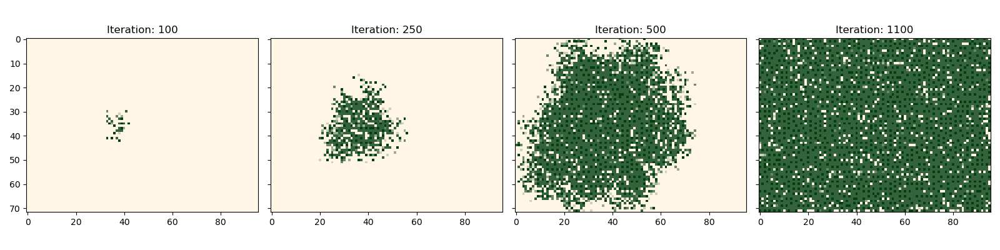

# stardew-tree-sim
This repository is a project that explores a simulation and mathematical analysis of a simplified model of tree dynamics, based on how trees grow and spread in the video game [Stardew Valley](https://www.stardewvalley.net/). 

## Overview of a Stardew Valley Forest


THe screenshot above shows an example of the vegetation on a farm in Stardew Valley. There are several types of trees, grass, and other vegetation. The trees and grass naturally spread to fill available space. Thinking like a biologist, we might wonder: How quickly do the trees fill area? Can the tree populations go extinct? Given several types of trees, will one of the tree species eventually go extinct? While certainly not needed to play the game, answers to these questions give insight into more serious questions in mathematical biology. These questions are the kind we might use a model of real world tree populations to study. In either case, we have to figure out how to calculate the emergent properties of these dynamics. 

First, let's note that the dynamics occur on a grid. You can see a red square that indicates one cell of this grid.


If we draw the grid, we see that each individual tree, tuff of grass, bush, and so on occupy a single cell in a grid. 


If we focus on the trees, we see that there are five stages of living trees. The first four are a **planted seed** (stage 1), a germinate **seedling** (stage 2), a **bush** form (stage 3), and a **sapling** (stage 4).   


The fifth stage is a mature tree (stage 5). Trees can die and leave stumps not shown. 


Because there is a discrete set of stages on a discrete,  we can represent the tree population dynamics using cellular automata.


## Stardew Valley Tree Dynamics as a Cellular Automaton

Basically, a [Cellular Automaton](https://en.wikipedia.org/wiki/Cellular_automaton) is a grid of cells (or lattice represented by integer points $\mathbb{Z}^n$). Each cell contains a value, representing the state of that cell. In a cellular automaton, the states are also discrete and can be represented as integers. Let's call a grid with a specific choice of state for each cell, a configuration of the grid (sometimes this is also called a state). The states change over time but time is discrete as well. How the grid changes is determined by applying a *transition rule* or *update rule* to its current configuration. This transition rule plays the same role as an equation of motion or other. Stardew valley trees are a good example of how cellular automata can represent real-world phenomena, even when those phenomena aren't really discrete. The trees occupy positions on a lattice and the lattice has a state for each tree growth stage and a state for empty ground. Note we can simply add more states to represent other tree species or grass, etc.  Here's an example


While in principle one could define a transition rule that is any function maps configurations to other configurations, in practice it is more interesting to use transition rules which are defined **locally**. That means, for a given cell, its change in state during one transition depends only on its current state and the state of nearby cells. For example, in the grid below, the next state of the blue cell depends on its current state and the current state of the surrounding gray cells. 


If we define a local transition rule for each **neighborhood**, we can apply this rule for every cell and its neighborhood to define a transition rule for an entire grid. Note we sometimes have to make special choices for the boundary of the grid, similar to boundary conditions for differential equations. We can vary the neighborhood for rules that have a longer distance spatial interaction. 


In many physical systems, we wish represent to how some quantity varies in space and time in a region of space. Think for instance how an electric and magnetic field. Or the distribution of temperature and pressure. Or in this case, the distribution of trees by various growth stages. There are several common ways to represent such systems mathematically. A quick way to classify them is by asking if states, time, space are discrete or continuous. Continuous states, time, or space means we can use $n$_tuples of real numbers $\mathbb{R}^n$ instead of integers $\mathbb{Z}^n$. Cellular automata are what you get when all three are discrete. You can see some other examples.


|      |            | Space                       |                                 |                                           |                                |
| ---- | ---------- | --------------------------- | ------------------------------- | ----------------------------------------- | ------------------------------ |
|      |            | Discrete                    |                                 | Continuous                                |                                |
|      |            | Discrete States             | Continuous States               | Discrete States                           | Cont. States                   |
| Time | Discrete   | Cellular Automata           | Iterated Maps/Functions         | Integral Equations                        | Integral Equations             | 
|      | Continuous | Markov Processes (via prob) | Ordinary Differential Equations | Partial Differential Equations (via prob) | Partial Differential Equations |


Although these mathematical representations of the same physical systems are very different, they often serve as good approximations for one another. Sometimes by converting from one form to another, we get new insight. However, this has to be done with care, because not all cellular automata can be represented as a partial differential equation, so there might not be any conversion. But usually interesting physical systems have symmetries or other properties that make this conversion possible. For instance, cellular automata usually have translational symmetries and rotational symmetries with their grid. At large scales, these symmetries approximate the continuous symmetries of continuous space. The local transition rules of cellular automata correspond to the local rules of partial differential equations. We can also use different grids, so hexagonal grids or triangular grids are also possible for cellular automata, but more complicated to program. It turns out that the emergent properties of interesting physical systems often do not depend strongly such choices.


## How do trees grow? 

To start thinking about transition rules, trees have two major processes here. They grow and they reproduce. In Stardew Valley, these processes occur over night while the player sleeps. Thus our transition rule is discrete time. Of these processes, growth is simpler. Note there are five growth stages. According to the [Stardew Valley wiki on trees](https://stardewvalleywiki.com/Trees#Growth_Cycle), the oak, maple, and pine trees have a 20% chance to grow per night increase in growth state, except for the transition from growth state $s=4$ to growth stage $s=5$. The transition from $4\to 5$ cannot occur for a given cell, if there is a stage 5 tree in the Moore neighborhood (the 8 currounding cells) of the cell. 

The wiki says this last transition takes "twice as a long" (which should mean a 10%), however, investigating the [decompiled game code](https://github.com/veywrn/StardewValley/tree/master), the method which updates tree, the method [Tree:dayUpdate](https://github.com/veywrn/StardewValley/blob/master/StardewValley/TerrainFeatures/Tree.cs) appears to show a 20% for the last stage. We won't worry too much about that, because ultimately we want to calculate how much the overall behavior depends on such choices. Note that we will only consider the case of unfertilized trees in Stardew Valley. Because growth is random, we have a stochastic cellular automaton, with a stochastic transition rule. This makes the growth of an individual tree into a [Markov chain](https://en.wikipedia.org/wiki/Markov_chain). We can represent this diagrammatically as:


This also makes the entire grid into a Markov chain. There exists a matrix which specifics the transition probability from any possible configuration of the grid to any other possible configuration. But the number of configurations is so large, even for small grids and this matrix is stupendous in size. For one tree species, 48 by 64 grid has on $6 ^ {48 \times 64}$ possible configurations which is on the order of $10^{2390}$. For a quick size comparison, the [age of the universe](https://en.wikipedia.org/wiki/Hubble%27s_law#Hubble_time) is estimated at only $4.55 \times 10 ^{17}$ *seconds* and the number of orderings of a deck of 52 playing cards is only $52! \approx 10^{68}$.   Note however that for most pairs of grids, the transition probability is zero. 

For the most part, this transition rule is independent with no spatial interactions at except for the last stage. If we ignore this part, we get a transition matrix that looks like this:


Here each entry of the matrix gives a transition probability  $A_{ij} = \Pr ( j \to i) $. If we know the initial state, we can just look at the corresponding column to get the transition probabilities. Note that the diagonals are the probability that no change occurs. Note also that the final stage is an *absorbing state*. Once a tree is mature, it stays there in this Markov chain (other processes will change that later). Using matrix powers $A^n $, we can calculate the probability of transition from a given state $j$ to any other state $i$ after $n$ transitions (or $n$ nights in game). This means that the entry $(A^n)_{51}$ is the cumulative density function $F(n) $ for the growing time, the number of days (or nights) until fully grown. The CDF $F(n)$ is the probability that after $n$ days, a tree has fully grown (neglecting any spatial effects). The probability that the growing time is exactly $k$ days is $f(k) = F(k) - F(k-1)$ and from this probability mass function $f$, it is possible to calculate the mean growing time. We can use the CDF to calculate the median growing time.


All in all, it takes around a month for a tree to grow from a planted seed to full maturity. Note the tree fertilizer shortens this to 4 days exactly.   

Here's the game code from the decompiled code. The comments are mine and help highlihgt the important information.
```cs
    // checks if night is in growing season, whether or not a tree is present, and if it's fertilized
    if (!Game1.GetSeasonForLocation(currentLocation).Equals("winter") || (int)treeType == 6 || (int)treeType == 9 || environment.CanPlantTreesHere(-1, (int)tileLocation.X, (int)tileLocation.Y) || fertilized.Value)
    {
        string s = environment.doesTileHaveProperty((int)tileLocation.X, (int)tileLocation.Y, "NoSpawn", "Back");
        if (s != null && (s.Equals("All") || s.Equals("Tree") || s.Equals("True")))
        {
            return;
        }

        // if growth stage is four, check for neighbors
        if ((int)growthStage == 4)
        {
            // loop through neighborhood
            foreach (KeyValuePair<Vector2, TerrainFeature> t in environment.terrainFeatures.Pairs)
            {   
                // check if neighborhood has at least one tree that's growth stage 5 or greater, then don't grow.
                if (t.Value is Tree && !t.Value.Equals(this) && (int)((Tree)t.Value).growthStage >= 5 && t.Value.getBoundingBox(t.Key).Intersects(growthRect))
                {
                    return;
                }
            }
        }
        else if ((int)growthStage == 0 && environment.objects.ContainsKey(tileLocation))
        {
            return;
        }

        // roll for growth for mahogany trees (15% chance); increases to 60% if fertilized.
        if ((int)treeType == 8)
        {
            if (Game1.random.NextDouble() < 0.15 || (fertilized.Value && Game1.random.NextDouble() < 0.6))
            {
                growthStage.Value++;
            }
        }
        // roll for growth for all other tree type; growth probability is increased to 1 if fertilized
        else if (Game1.random.NextDouble() < 0.2 || fertilized.Value)
        {
            growthStage.Value++;
        }
    }
```


## How do trees reproduce? 

Next, we move on to how the trees reproduce. The rule is similar to the growth rule. Every night (transition), each mature tree has a 15% probability of spawning a new planted seed in a 7 by 7 box centered (box of radius 3). The planted seed has an equal chance of going in any cell that is empty. 


However, that's the rules as described on the wiki page, but it was not entirely clear to me how certain edges cases work. So I checked out the game code (annotatations are mine)


```cs
// check if stage s >= 5  and roll for reproduction with 15% chance
if ((int)growthStage >= 5 && environment is Farm && Game1.random.NextDouble() < 0.15)
			{   
                // randomly select coordinates in 7 x 7 box centered at tree location
				int xCoord = Game1.random.Next(-3, 4) + (int)tileLocation.X;
				int yCoord = Game1.random.Next(-3, 4) + (int)tileLocation.Y;
				Vector2 location = new Vector2(xCoord, yCoord);
                
                // check if selected coordinates are a valid loction 
				string noSpawn = environment.doesTileHaveProperty(xCoord, yCoord, "NoSpawn", "Back");
				if ((noSpawn == null || (!noSpawn.Equals("Tree") && !noSpawn.Equals("All") && !noSpawn.Equals("True"))) && environment.isTileLocationOpen(new Location(xCoord, yCoord)) && !environment.isTileOccupied(location) && environment.doesTileHaveProperty(xCoord, yCoord, "Water", "Back") == null && environment.isTileOnMap(location))
				{
                    // add tree at new location
					environment.terrainFeatures.Add(location, new Tree(treeType, 0));
				}
			}
```

Notice that the game first rolls to see if a tree reproduces, then generates a random location in the 7x7 neighborhood aroun the tree. If the selected location is empty, a new seed is created there; otherwise nothing happens. That means two things: trees don't produce more than one seed per reproduction event, and also the 15% is the probability that the tree reproduces in an empty grid. There's 49 spaces, so if only 15 are free, then the chance that this tree adds one new seed is only $15/49 * 0.15 = 9/196$ chance. This means that the rate of reproduction depends on the local density of available space and therefore population density is self-limiting. 

The game updates the grid of trees sequential, so it calculates whether a cell changes going from west to east (left to right) then north to south (top to bottom)  starting from the north-west (top-left) corner, and ending in the south-east (bottom-right) corner. That means the grid's update is not symmetric and has a slight spatial bias. If there is one space empty, and two trees close enough to fill it by reproduction; the north-western one has a higher chance to (15%) than the south-eastern one $(1 - 0.15)0.15 = 12.75%$. But we won't worry about that issue, since all trees are exactly the same. 


## How do trees die?

As far as I can tell, Stardew Valley trees don't have any reliable rate of mortality. Or rather the only way trees are removed is that the player removes them. However, it's easy to see that without some mechanism to remove trees, the grid will simply fill with trees at the highest stage possible. Thus, it would be interesting to add a chance that a stage 5 tree dies per night, which could represent a natural mortality, or it could represent removal by player (or rather an idealized player, since real players wouldn't remove trees at random but according to their needs).  

## Putting it all together

For a basic simulation, the code is simple enough. We only have one type of tree, and five growth stages (plus 0 to represent an empty cell). We will use `numpy` ndarray's for the grid. The array `arr` can either be *space only grid* and store the current state, or the array can be *spacetime grid*  and store every iteration. The grid gets large very fast, so we wouldn't want to do this if the grid was too large, since the grid takes space in memory. Instead, we might save statistics (see the next section), rather than the entire grid. We have a few parameters like grid size. We also must put a single tree to start. 


```python
import numpy as np

# GRID PARAMETERS 
ntree = 5 # number of tree growth stages
num =12*2  # size, linear dimension s
iterations = 800 # number of iterations to calculate

# INITIALIZE GRID
# grid size enforces 4:3 aspect ratio
arr_shape = (iterations+1, 3*num, 4*num )

arr = np.zeros(arr_shape, dtype='int64')

# place one stage-1 tree in the middle
x, y = round(1.5 *num), round(1.5*num)
arr[0, x, y] = 1
```

Now we start defining the transition rule. First, we will set up some arrays that define the neighborhood for growth and reproduction. We also set the *vital* (meaning life) parameters for the probability of growth, reproduction, and mortality per time step. 

```python 
# RULE PARAMETERS
# neighborhoods : sets distance of spatial interaction 
growth_neighborhood = np.array([[1,1,1],[1,0,1],[1,1,1]])
reprod_neighborhood = np.ones((7,7),dtype='int64')
reprod_neighborhood[3,3] = 0 

# vital parameters  
reprod_prob = 0.15
grow_prob = 0.2
mort_prob = 0.01
```

Now we set the transition rules. Essentially, we are going to iterate over the entire grid and decide how each cell changes. For cells in stage 1, 2, and 3, we generate a random number to see if they successfully grow. For a 20% probability, that means rolling a d20 die and the cell grows to the next stage if the roll is a 17 or higher. Cells with the growth stage 5 can only die, so the same thing. Note that these processes have no spatial dependence, so they can be calculated in parallel (or vectorized). 

Stage 4 can only grow if there are no stage 5 trees in its neighborhood. Stage 0 (the empty cell) only becomes a filled cell if there are stage 5 trees in reproduction range. Thus the spatial interactions require counting how many cells with a certain stage are in a given neighborhood. We can use a nice mathematical trick to do the counting: convolutions. Convolution is used extensively in signal and image filtering. It is essentially a locally weighted sum or average. I won't explain the details of convolution exactly, but we can take advantage of code designed to calculate the convolution fast. Here's the definition:

\[ w \star s = \int w(x-y)f(y) dy  = \sum_y w(x - y) f(y) \]

So if we have a grid where $f(y)$ assigns some value to the cell $y$, then $w$ gives weights to grid cells in the neighborhood around it. The convolution is thus the weighted average or sum. So $w$ is the Moore neighborhood and $1_{s=5}(s)$ is an indicator function: it equals 1 when $s=5$ and zero otherwise. Then the convolution $n_{s=5} = w \star 1_{s=5}(s(x))$  returns a function $n_{s=5}(x)$ which is the total number of the stage-5 trees in eight squares around the cell $x$. Pretty neat huh!


Note that the game does not use convolutions, and just does a for-loop over the neighborhood. For the game, a for-loop is fine because the grid is small and only updated once per game-night (about 20 min of gameplay). A loading screen occurs, so the game could take several seconds to compute the update (it computes other things). The for-loop is easier to mesh with other aspects of the game and there isn't a need for speed. But if we wanted to simulate much larger grids and over longer periods of time, if we can speed up the calculation, then we can save a lot of time in longer simulations. So it would be nice to use the convolutions. Also, convolutions have nice mathematical properties. So even when it isn't convenient to program the game as a convolution, if we can express the game's calculation, we can still use the properties of convolutions to reason about the simulation. It turns out that this is the case for the growth interference. Counting the number of stage 5 trees blocks stage 4 trees from becoming stage 5, and that can be expressed using a convolution. It is equivalent to how the game simulates the update, although the game doesn't directly calculate a convolution. 

We run into a slight problem however for the reproduction. See the game rolls for each stage 5 tree to see if it reproduces, then if it does, the game randomly chooses an empty cell to put the new seedling. The reproduction event fails if the selected space is not empty; and one tree can only produce one offspring per time step. However, we would like to find a function that gives the probability a given empty cell becomes non-empty. One way to do that is to count the number of stage-5 trees in a neighborhood around the empty cell, and give each one a chance to reproduce into the empty cell. The number of stage-5 trees in the neighborhood can be calculated by convolution. Each one reproduces with a rate of 15% per time step, and selects a given empty cell with probability $1/(7^2 - 1) = 1/48 $. Thus, we can take the overall probability to be $ \beta r_{s=5}(x)/48 $. 

However, this isn't the same rule. In the game, the maximum number of offspring per time step is one. A single stage-5 tree cannot add more than one offspring per night. So imagine a cell with stage 5, surrounded by emtpy cells. Every one of the empty cells has $\beta/48$ of getting an offspring in a single night under our rule, and their probabilities are independent under our rule. The game's rule makes the probability correlated, so the probability of any particular empty cell getting an offspring is correlated. Under the game's rule, there's a  $\beta=15\%$ chance that add one new tree is added to the grid, whereas our rule adds anywhere between 0 and 48 offspring, but the average number added per night is still $\beta$, which is the same average as the game's rule. The variance is different, but we will address this later. Let's go with the convolution rule for now.  

Since it is easier to write the update rule as a for-loop, we will use numba's Just-In-Time (JIT) compiler to speed up the for-loop. However, the convolutions let us calculate the spatial dependence in one fast-step, so the update rule for each cell is parallelizable. Moreover, the convolutions could be further optimized if needed (e.g., saving the fourier transforms, etc.).

``` python 
from numba import njit
from scipy.signal import convolve

def iterate(arr):
    out = np.empty_like(arr)

    S_5 = arr > 4  
    N_5 = convolve(S_5, growth_neighborhood, mode='same') 
    R_5 = convolve(S_5, reprod_neighborhood, mode='same')
    
    grow_reproduce(out, arr, N_5, R_5)
    return out

@njit
def grow_reproduce(out, arr, N5, R5):
    for i in range(arr.shape[1]):
        for j in range(arr.shape[2]):
            s = arr[i,j]
            u = np.random.rand()
            if s == 0:
                out[i,j] = u < (R5[i,j]/48  *reprod_prob)
            if s == 5:
                out[i,j] = 5 * (u >= mort_prob)     
            if 1 <= s < 4:
                out[i,j] = s +  1 * (u < grow_prob)
            if s == 4:
                out[i,j] = s + (u < grow_prob) * (N5[i,j] < 1)


def simulate(arr):
    for n in range(iterations):
        arr[n+1] = iterate(arr[n])
```

Now we just call the `simulate` function to run the simulation. This code can be found in `sim_v1.py`. The data can then be animated or plotted. Try `animate_v1.py' to make an animation. 




# Analysis of the dynamics.

However, we shouldn't stop at making a simulation. Simulations are only useful if we learn something from the simulation. Let's analyze the dynamics. We'll start by looking at some statistics, namely population growth. The first plot shows how the empty grid gives way to a forest. The vertical bars correspond to the grid at a certain iteration (see the previous image): here at 100, 250, 500, 1100. The second plot shows the number of stage 4 and 5 trees, while the last shows the first three stages. 


We immediately see several interesting patterns. 

1. Population growth is a sigmoidal shape (S-shape) curve. The total of trees increases at an accelerating rate which slows and stops as the grid fills. 
2. Stages 1-3 all have about the same number of trees at any time. 
3. The number of stage 4 and 5 trees is a constant ratio once the grid fills.
4. The grid ends up with a interesting pattern; the density and spacing of stage 5 trees is roughly the same.

Why do these patterns occur? Moreover how do they change if we modify the rules or parameters of the simulation?


